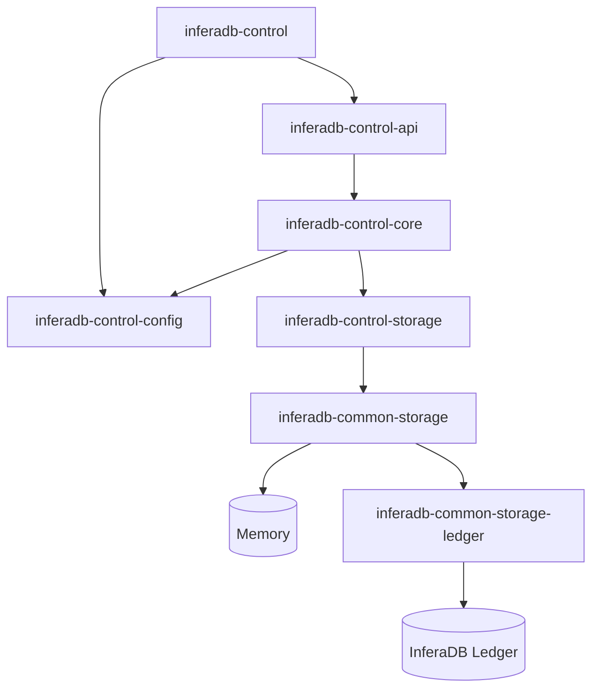

<div align="center">
    <p><a href="https://inferadb.com"></a></p>
    <h1>InferaDB Control Plane</h1>
    <p>
        <a href="https://discord.gg/inferadb"></a>
        <a href="#license"></a>
    </p>
    <p>Multi-tenant administration APIs with Kubernetes-native deployment and WebAuthn authentication</p>
</div>

> [!IMPORTANT]
> Under active development. Not production-ready.

## Quick Start

```bash
git clone https://github.com/inferadb/control && cd control
docker-compose up -d
export INFERADB_CTRL__AUTH__KEY_ENCRYPTION_SECRET=$(openssl rand -base64 32)
mise trust && mise install
cargo run --bin inferadb-control
```

| Endpoint | URL                             |
| -------- | ------------------------------- |
| REST API | `http://localhost:9090`         |
| gRPC API | `http://localhost:9091`         |
| Health   | `http://localhost:9090/healthz` |
| Metrics  | `http://localhost:9090/metrics` |

## Features

| Feature              | Description                                  |
| -------------------- | -------------------------------------------- |
| **Authentication**   | Password, passkey, OAuth, email verification |
| **Multi-Tenancy**    | Organization-based isolation with RBAC       |
| **Vault Management** | Policy containers with access grants         |
| **Client Auth**      | Ed25519 certificates, JWT assertions         |
| **Token Issuance**   | Vault-scoped JWTs for Engine API             |

## Architecture



| Crate                    | Purpose                        |
| ------------------------ | ------------------------------ |
| inferadb-control         | Binary entrypoint              |
| inferadb-control-api     | REST/gRPC handlers             |
| inferadb-control-config  | Configuration loading          |
| inferadb-control-const   | Shared constants               |
| inferadb-control-core    | Business logic, entities       |
| inferadb-control-storage | Repositories + storage factory |
| inferadb-control-types   | Shared type definitions        |

## Configuration

Environment variables use `INFERADB_CTRL__` prefix with double underscores for nesting:

| Variable                              | Description                                   |
| ------------------------------------- | --------------------------------------------- |
| `INFERADB_CTRL__LISTEN__HTTP`         | HTTP listen address (default: `0.0.0.0:9090`) |
| `INFERADB_CTRL__STORAGE`              | Storage backend: `memory` or `ledger`         |
| `INFERADB_CTRL__LEDGER__ENDPOINT`     | Ledger server URL                             |
| `INFERADB_CTRL__LEDGER__CLIENT_ID`    | Client ID for idempotency                     |
| `INFERADB_CTRL__LEDGER__NAMESPACE_ID` | Namespace for data scoping                    |

See [config.yaml](config.yaml) for all options.

## Development

```bash
# Setup
mise trust && mise install

# Common tasks (requires just)
just test      # Run tests
just lint      # Run clippy
just fmt       # Format code
just ci        # Run all checks

# Manual commands
cargo nextest run
cargo +1.92 clippy --workspace --all-targets -- -D warnings
cargo +nightly fmt --all
```

## Deployment

### Docker

```bash
docker run -p 9090:9090 inferadb/control:latest
```

### Kubernetes

```bash
helm install inferadb-control ./helm \
  --namespace inferadb \
  --create-namespace \
  --set config.storage=ledger \
  --set config.ledger.endpoint=http://ledger.inferadb:50051
```

See [helm/README.md](helm/README.md) for configuration options.

## Documentation

| Topic           | Link                                               |
| --------------- | -------------------------------------------------- |
| Getting Started | [docs/getting-started.md](docs/getting-started.md) |
| Authentication  | [docs/authentication.md](docs/authentication.md)   |
| Architecture    | [docs/architecture.md](docs/architecture.md)       |
| API Reference   | [openapi.yaml](openapi.yaml)                       |

## Community

Join us on [Discord](https://discord.gg/inferadb) for questions and discussions.

## License

Dual-licensed under [MIT](LICENSE-MIT) or [Apache 2.0](LICENSE-APACHE).
