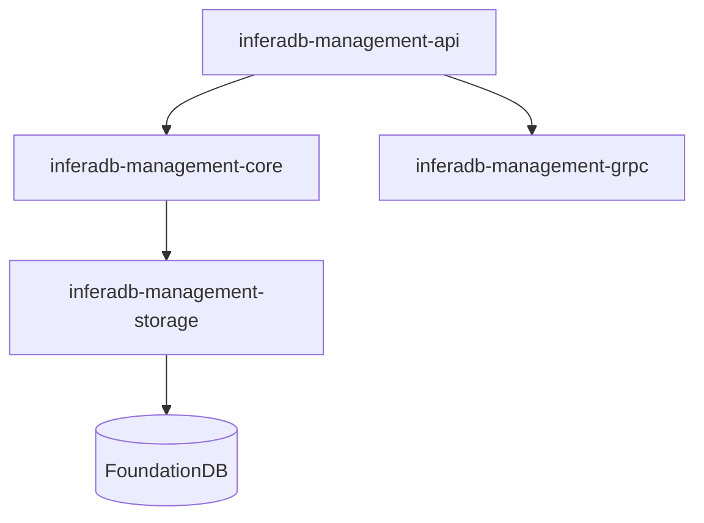

# InferaDB Management API

**Control plane** — multi-tenant orchestration with headless APIs, Kubernetes-native deployment, and WebAuthn authentication.

> [!IMPORTANT]
> Under active development. Not production-ready.

## Quick Start

```bash
git clone https://github.com/inferadb/management && cd management
docker-compose up -d
export INFERADB_MGMT__AUTH__KEY_ENCRYPTION_SECRET=$(openssl rand -base64 32)
cargo run --bin inferadb-management
```

Register and login:

```bash
# Register
curl -X POST http://localhost:3000/v1/auth/register \
  -H "Content-Type: application/json" \
  -d '{"email": "alice@example.com", "password": "securepass123", "name": "Alice"}'

# Login
curl -X POST http://localhost:3000/v1/auth/login/password \
  -H "Content-Type: application/json" \
  -d '{"email": "alice@example.com", "password": "securepass123"}'
```

| Endpoint | URL                             |
| -------- | ------------------------------- |
| REST API | `http://localhost:3000`         |
| gRPC API | `http://localhost:3001`         |
| Health   | `http://localhost:3000/health`  |
| Metrics  | `http://localhost:3000/metrics` |

## Features

| Feature              | Description                                  |
| -------------------- | -------------------------------------------- |
| **Authentication**   | Password, passkey, OAuth, email verification |
| **Multi-Tenancy**    | Organization-based isolation with RBAC       |
| **Vault Management** | Policy containers with access grants         |
| **Client Auth**      | Ed25519 certificates, JWT assertions         |
| **Token Issuance**   | Vault-scoped JWTs for Server API             |

## Key Concepts

| Entity       | Description                                   |
| ------------ | --------------------------------------------- |
| User         | Account with auth methods (password, passkey) |
| Organization | Workspace with members and roles              |
| Vault        | Authorization policy container                |
| Client       | Service identity with Ed25519 certs           |
| Team         | Group-based vault access                      |

**Auth Flow:** User → Session → Vault access → JWT → Server API

## Architecture



| Crate                       | Purpose                  |
| --------------------------- | ------------------------ |
| inferadb-management-api     | REST/gRPC handlers       |
| inferadb-management-core    | Business logic, entities |
| inferadb-management-storage | Memory or FoundationDB   |
| inferadb-management-grpc    | Server API client        |

## Configuration

```bash
INFERADB_MGMT__STORAGE__BACKEND=foundationdb
INFERADB_MGMT__STORAGE__FDB_CLUSTER_FILE=/etc/foundationdb/fdb.cluster
INFERADB_MGMT__SERVER__HTTP_PORT=3000
INFERADB_MGMT__AUTH__KEY_ENCRYPTION_SECRET=<base64>
```

See [config.yaml](config.yaml) for all options.

## Development

```bash
cargo test                    # All tests
cargo clippy -- -D warnings   # Lint
cargo fmt                     # Format
```

## Deployment

```bash
cargo build --release
./target/release/inferadb-management --config /etc/inferadb/config.yaml
```

See [docs/deployment.md](docs/deployment.md) for Kubernetes.

## Documentation

| Topic           | Link                                               |
| --------------- | -------------------------------------------------- |
| Getting Started | [docs/getting-started.md](docs/getting-started.md) |
| Authentication  | [docs/authentication.md](docs/authentication.md)   |
| Architecture    | [docs/architecture.md](docs/architecture.md)       |
| API Reference   | [openapi.yaml](openapi.yaml)                       |

## License

[Business Source License 1.1](LICENSE.md)
