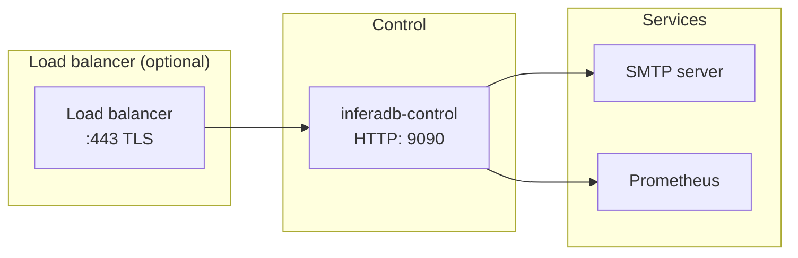
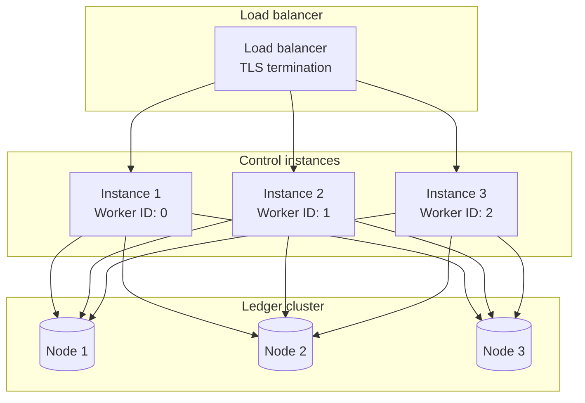
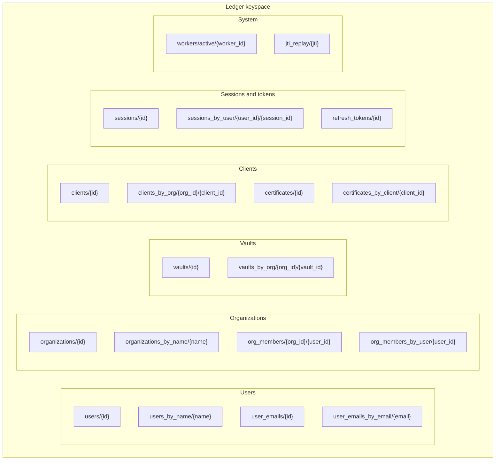
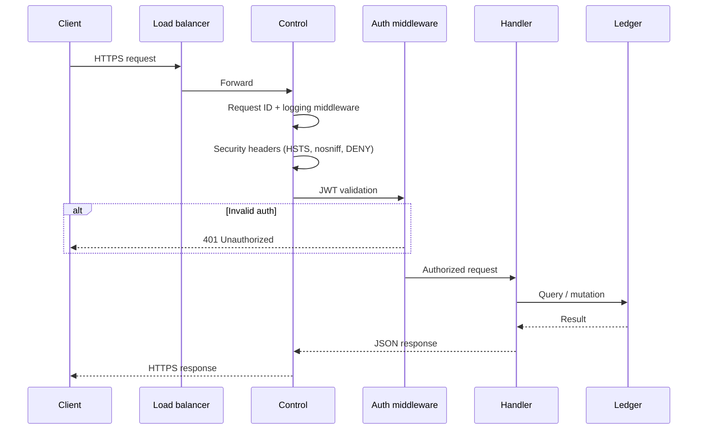

# System architecture

The Control Plane is the administration layer between client applications and the InferaDB Engine, handling authentication, multi-tenant organization management, vault lifecycle, and access control.

Without a centralized control plane, every service consuming InferaDB would need to independently manage credentials, enforce RBAC, and coordinate vault provisioning. Control consolidates these concerns into a single API surface with consistent security guarantees.

## Component layers

Control follows a layered architecture. Each layer has a single responsibility and communicates only with adjacent layers.

```mermaid
graph TB
    subgraph "Client layer"
        Dashboard[Web Dashboard]
        CLI[CLI Tools]
        SDK[SDKs]
    end

    subgraph "API layer"
        REST[HTTP REST API<br/>Port 9090]
    end

    subgraph "Handler layer (api crate)"
        Auth[Auth handlers]
        Org[Organization handlers]
        Vault[Vault handlers]
        Client[Client handlers]
        Token[Token handlers]
        Schema[Schema handlers]
        Team[Team handlers]
        Audit[Audit log handlers]
    end

    subgraph "Core layer (core crate)"
        Crypto[Cryptography]
        JWT[JWT service]
        Email[Email service]
        WebAuthn[WebAuthn]
        RateLimit[Rate limiting]
    end

    subgraph "Storage layer"
        Ledger[Ledger SDK<br/>(Production)]
        Memory[In-memory<br/>(Development)]
    end

    subgraph "External services"
        SMTP[SMTP server]
        Metrics[Prometheus]
    end

    Dashboard --> REST
    CLI --> REST
    SDK --> REST

    REST --> Auth
    REST --> Org
    REST --> Vault
    REST --> Client
    REST --> Token

    Auth --> Email
    Token --> JWT
    JWT --> Crypto

    Vault --> Ledger
    Vault --> Memory

    Email --> SMTP
    REST --> Metrics
```

### Crate dependency chain

```
inferadb-control (bin) --> api --> core --> storage --> inferadb-common-storage --> Ledger
```

| Crate | Purpose |
|---|---|
| `control` | Binary entrypoint |
| `api` | HTTP handlers, middleware, route definitions |
| `core` | Auth, crypto, JWT, email, rate limiting |
| `config` | CLI configuration (`clap::Parser`) |
| `storage` | Storage factory, backend abstraction |
| `types` | `Error` enum, `Result` alias |
| `const` | Compile-time constants (limits, durations, auth) |

## Deployment topologies

### Single instance

Suitable for development and small deployments. Uses in-memory storage (data lost on restart).



### Multi-instance (production)

Requires Ledger backend. Each instance needs a unique worker ID (0--1023) for Snowflake ID generation.



Worker IDs are assigned statically via `--worker-id` or `INFERADB__CONTROL__WORKER_ID`. In Kubernetes, derive from the StatefulSet pod ordinal.

## ID generation

All entities use 64-bit Snowflake IDs: `timestamp (41 bits) | worker_id (10 bits) | sequence (12 bits)`.

- Up to 4096 IDs per millisecond per worker
- Custom epoch: `2024-01-01T00:00:00Z`
- Serialized as strings in JSON responses (JavaScript integer precision)
- Collision detection: worker ID registration in Ledger with 30-second TTL and 10-second heartbeat

## Storage backends

### Ledger (production)

Data organized in Ledger's key-value keyspace, scoped by entity type:



Ledger's TTL garbage collector runs every 60 seconds on the Raft leader and filters expired entities at read time. No application-level cleanup jobs are required.

### In-memory (development)

HashMap-based storage with the same logical keyspace structure as Ledger. Data is lost on restart. Activated with `--dev-mode` or `--storage memory`.

## Request lifecycle



### Middleware stack (outermost to innermost)

1. **Request ID** -- assigns unique ID to each request
2. **Logging** -- structured request/response logging
3. **Security headers** -- `X-Content-Type-Options: nosniff`, `X-Frame-Options: DENY`, `Cache-Control: no-store`, `Strict-Transport-Security`
4. **CORS** -- configured for `frontend_url` origin
5. **Concurrency limit** -- 10,000 concurrent requests max
6. **Body size limit** -- 256 KiB default, 1 MiB for schema deployment
7. **Rate limiting** -- per-IP limits on auth (100/hour) and registration (5/day) endpoints
8. **JWT validation** -- local validation for reads, Ledger-validated for writes

## Security layers

| Layer | Mechanism |
|---|---|
| Transport | TLS 1.3 (terminated at load balancer) |
| Rate limiting | Per-IP on auth endpoints, distributed via Ledger |
| Authentication | JWT (Ed25519), cookie-based sessions, client assertions |
| Authorization | Organization RBAC (Member/Admin/Owner), vault roles (Reader/Writer/Manager/Admin) |
| Data protection | AES-256-GCM encryption at rest for private keys, Argon2id password hashing |
| Audit | Immutable audit log per organization |

## Technology stack

| Component | Technology |
|---|---|
| Language | Rust 1.92 (2024 edition) |
| Async runtime | Tokio |
| HTTP framework | Axum + Tower middleware |
| Storage | InferaDB Ledger (Raft-based) / In-memory HashMap |
| JWT signing | Ed25519 via `jsonwebtoken` |
| Password hashing | Argon2id |
| Encryption | AES-256-GCM |
| WebAuthn | `webauthn-rs` |
| Observability | `tracing` (structured logs), `metrics` (Prometheus) |
| Configuration | `clap::Parser` with env var fallbacks |
| Builder pattern | `bon` |
| Error handling | `snafu` |
