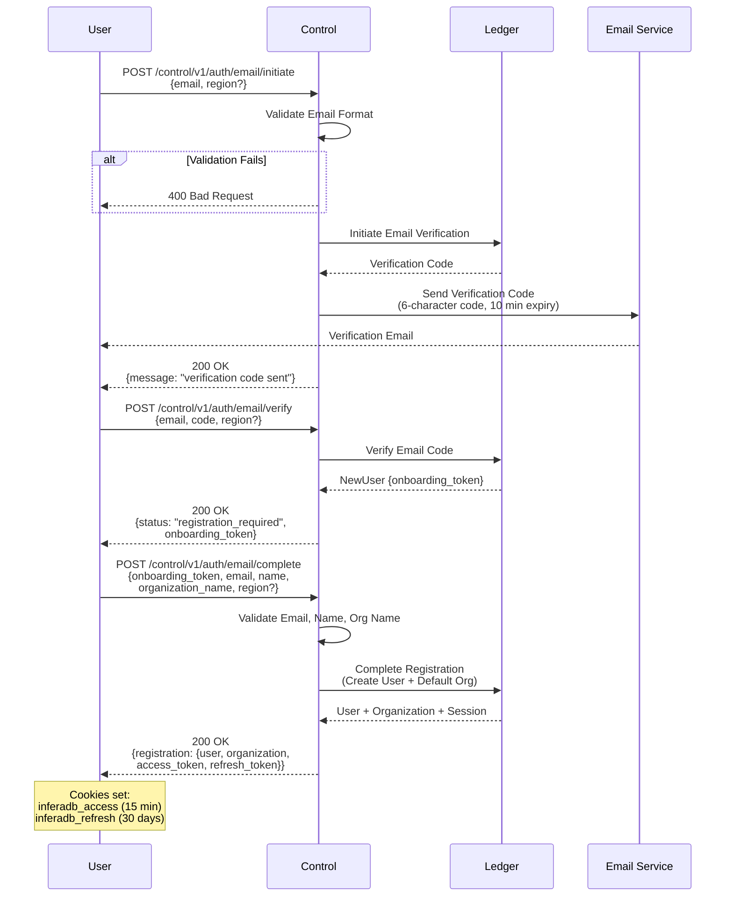
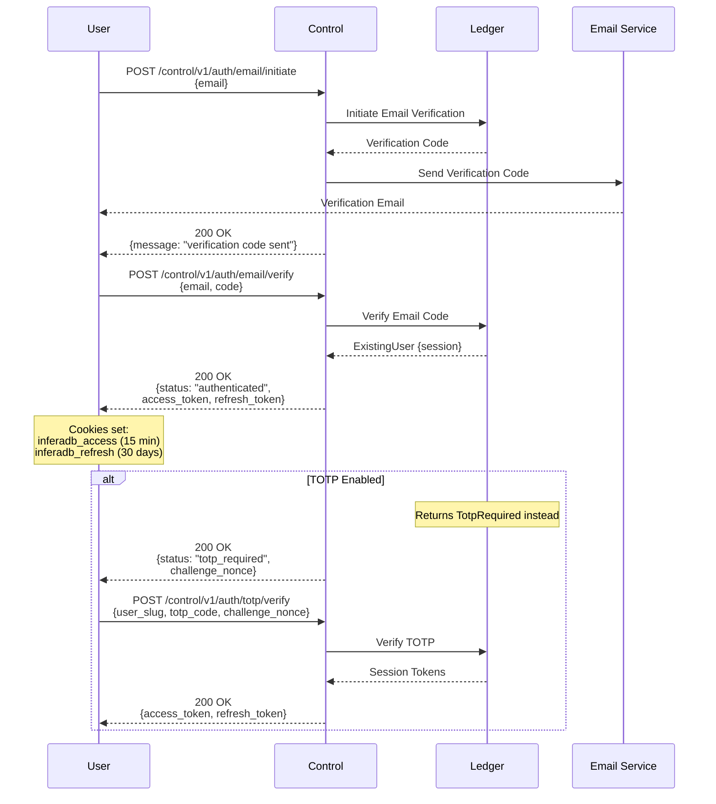
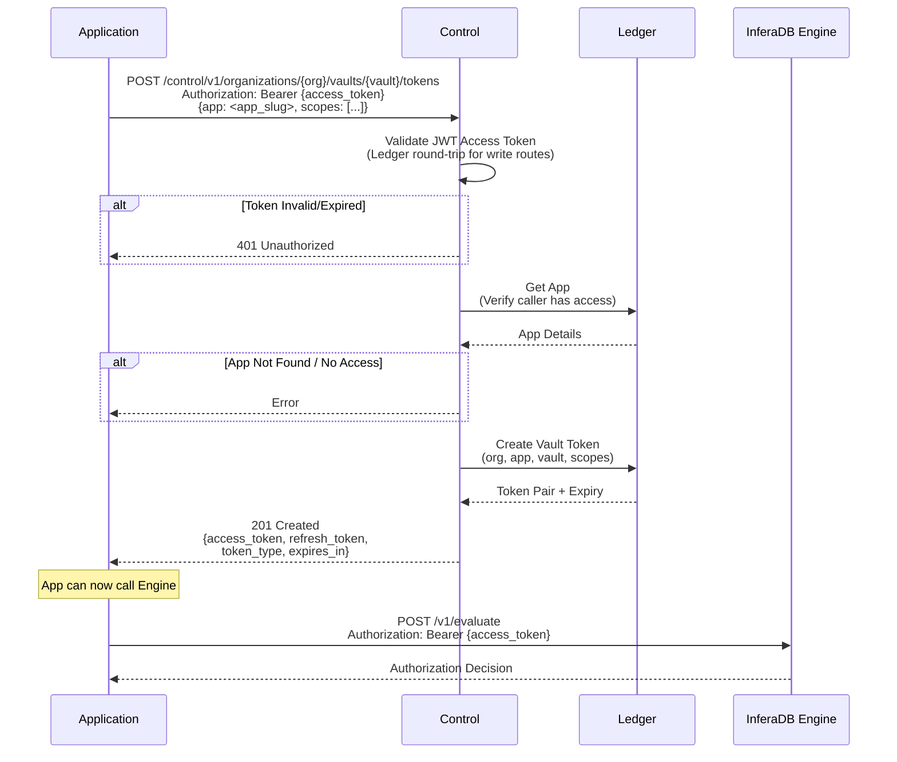
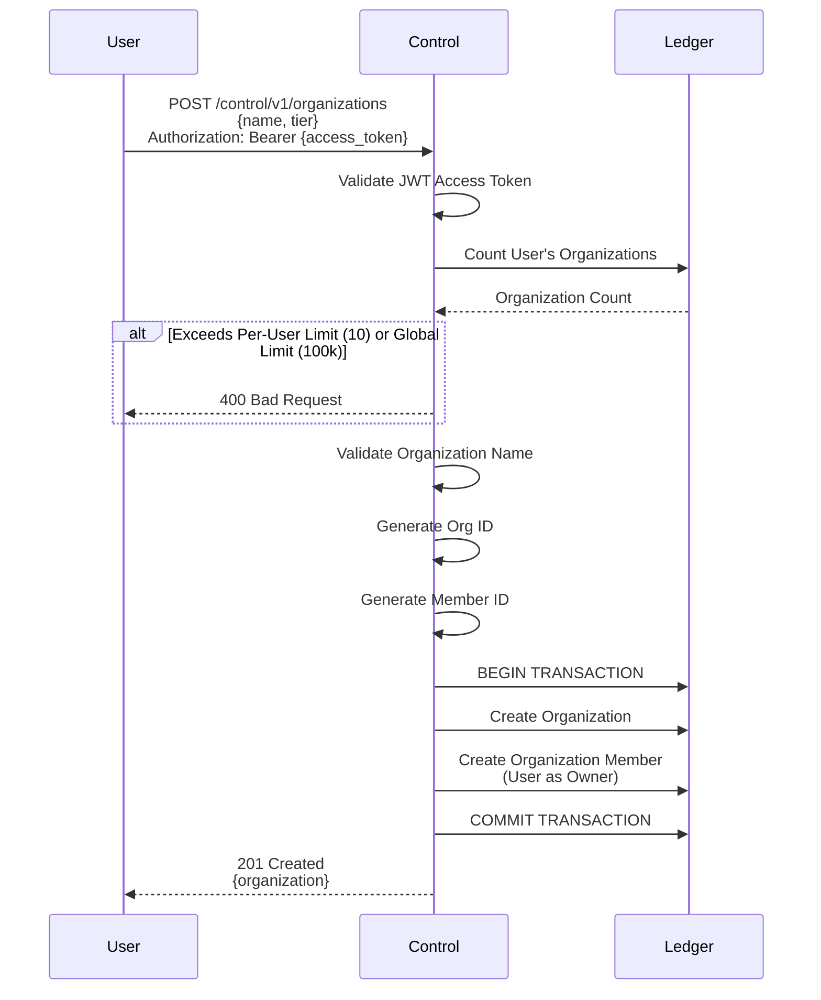
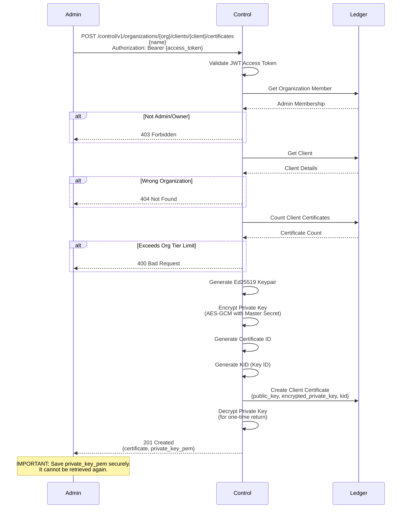
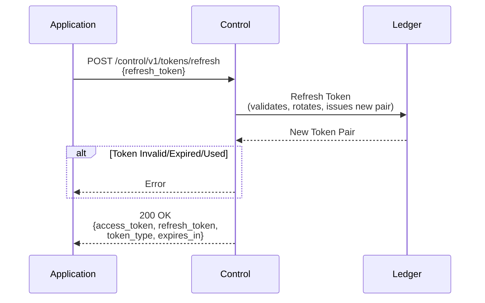
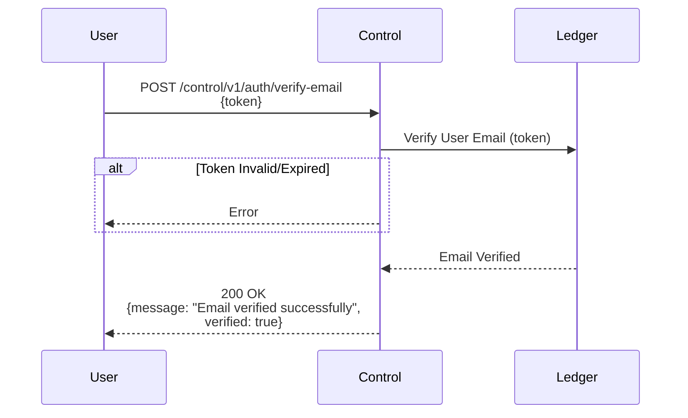
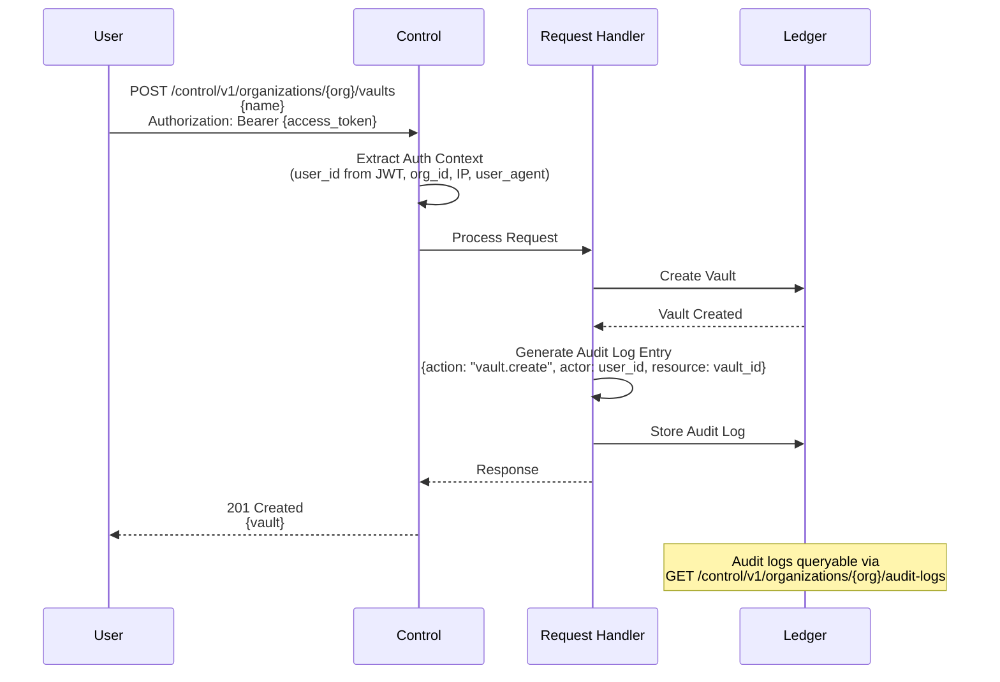
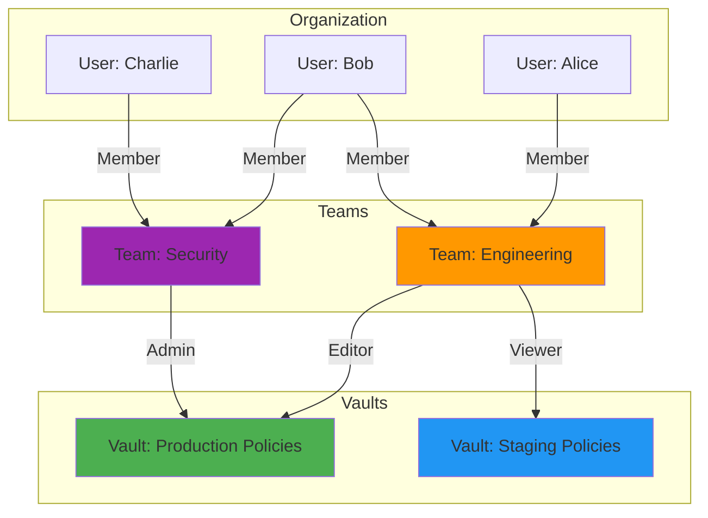
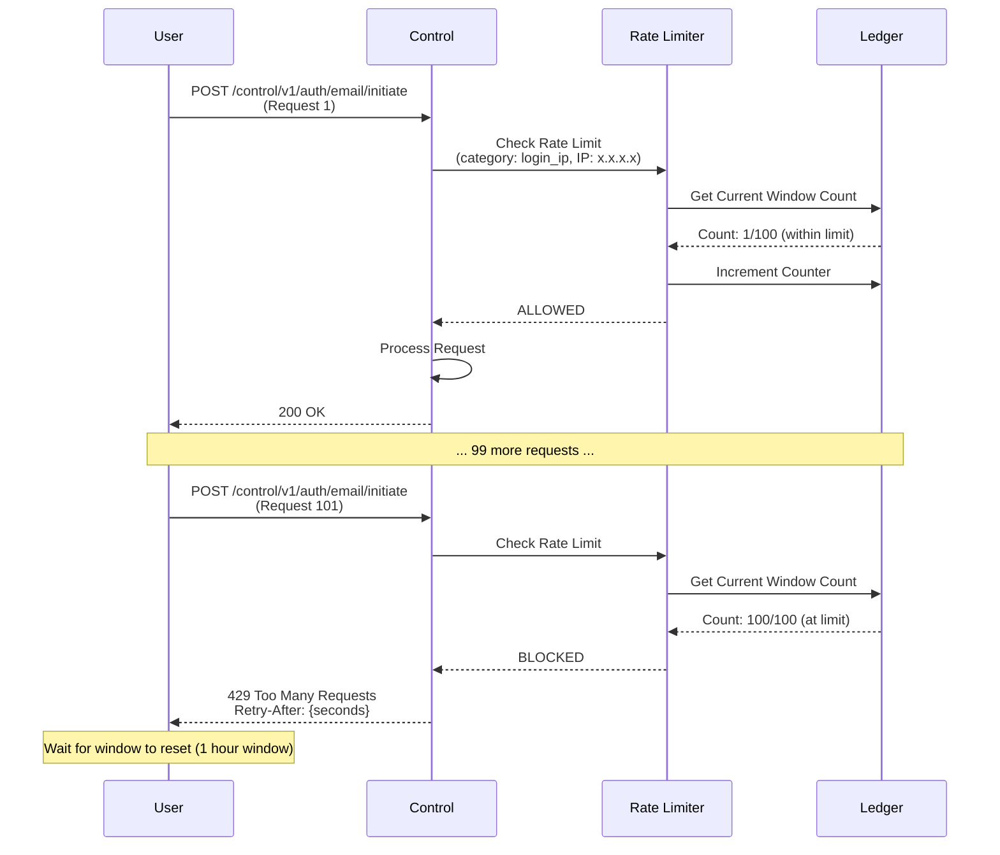

# Data Flows

This document illustrates the data flows for key operations in InferaDB Control.

## User Registration Flow

Registration uses the 3-step email code authentication flow. New users are detected at the verify step and must complete registration separately.

## Login Flow

Existing users authenticate via the email code flow. If TOTP is enabled, a second factor is required.

## Token Generation Flow

## Organization Creation Flow

## Client Certificate Generation Flow

## Refresh Token Flow

## Email Verification Flow

## Audit Log Flow

## Team-Based Vault Access

**Resulting Permissions:**

- **Alice**: Can edit Production (via Engineering), can view Staging (via Engineering)
- **Bob**: Can edit Production (via Engineering), can admin Production (via Security), can view Staging (via Engineering)
- **Charlie**: Can admin Production (via Security)

## Rate Limiting Flow

## Further Reading

- [Architecture](architecture.md): System architecture diagrams and deployment topology
- [Authentication](authentication.md): Detailed authentication mechanisms
- [Overview](overview.md): Complete entity definitions and data model
