# Data flows

Sequence diagrams for each authentication and token operation in InferaDB Control.

## Why it matters

These diagrams show the exact request/response sequences between your client, Control, Ledger, and the Email service. Use them to implement client integrations correctly and to debug authentication issues.

## Quickstart

The most common flow is email code login for an existing user:

```bash
# Step 1: Get a verification code
curl -X POST /control/v1/auth/email/initiate \
  -d '{"email": "you@example.com"}'

# Step 2: Verify the code
curl -X POST /control/v1/auth/email/verify \
  -d '{"email": "you@example.com", "code": "ABC123"}'
# -> {"status": "authenticated", "access_token": "...", "refresh_token": "..."}
```

## Registration (new user)

A new user goes through all three email auth steps: initiate, verify, and complete.

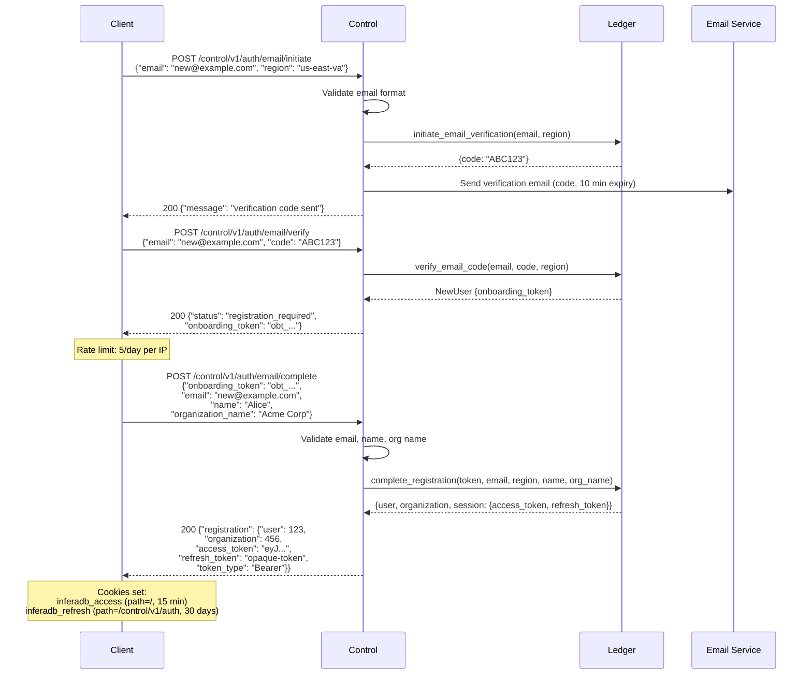

## Login (existing user, no TOTP)

An existing user without TOTP completes authentication in two steps.

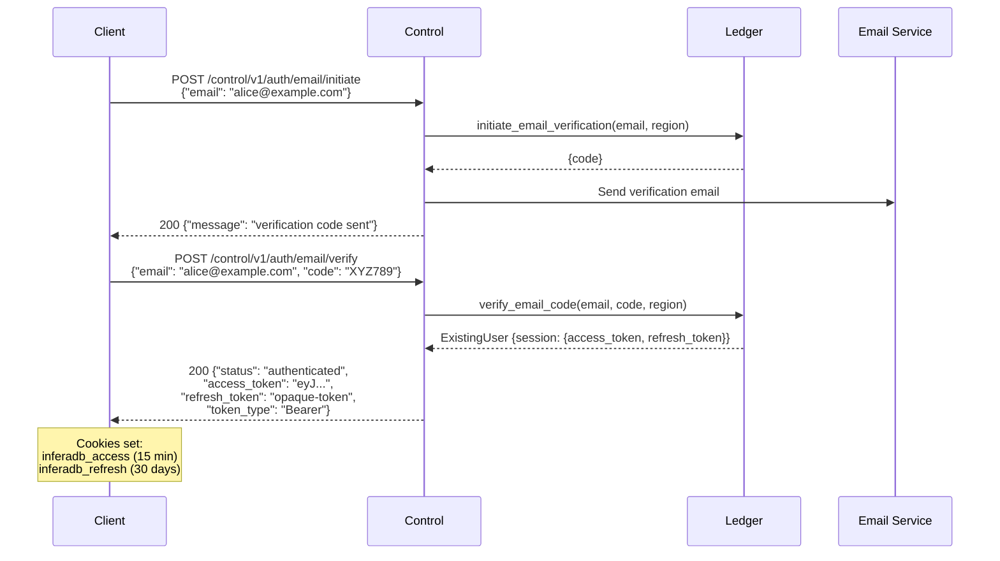

## Login with TOTP

When TOTP is enabled, the verify step returns a challenge nonce instead of tokens. The client must complete a second factor.

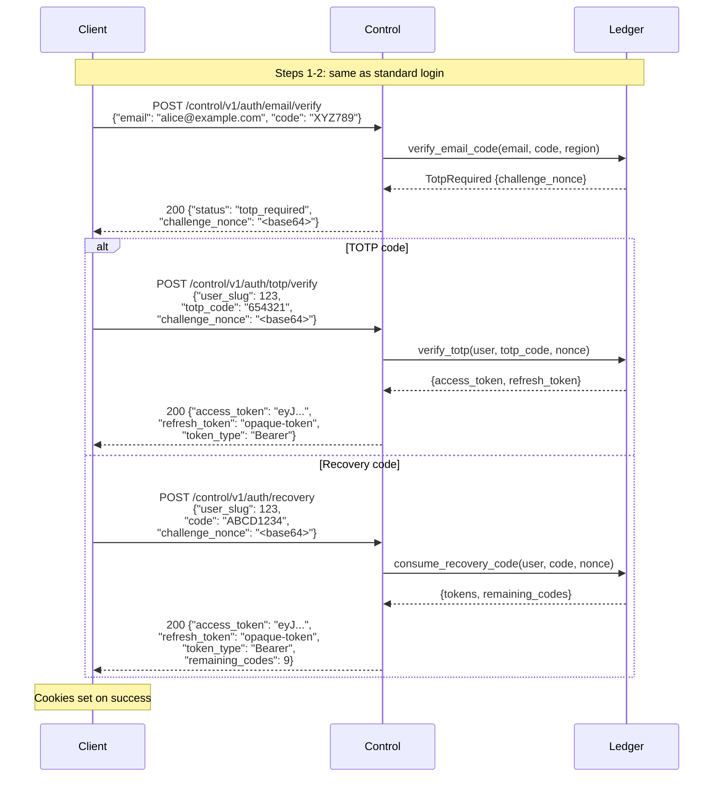

## Passkey authentication

Passkey authentication uses a two-step WebAuthn ceremony. Challenge state is encrypted into the `challenge_id` (no server-side storage).

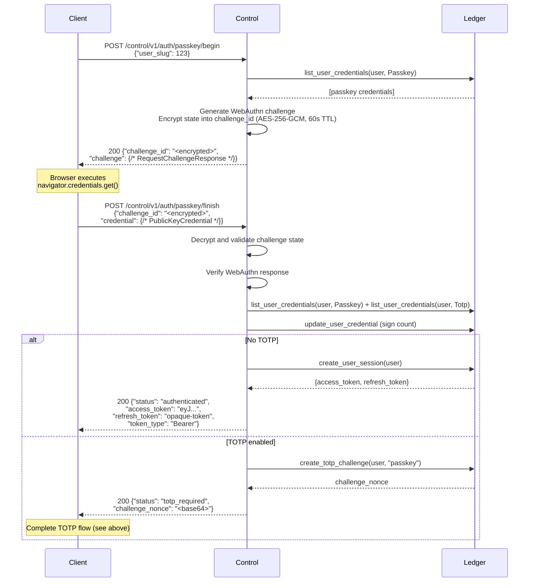

## Passkey registration

Requires an existing authenticated session. The registration endpoints are write routes (Ledger-validated JWT).

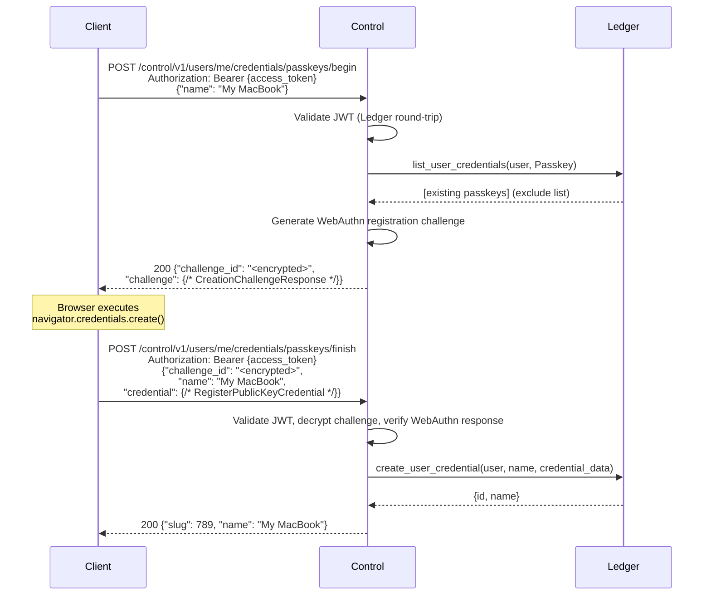

## Vault token generation

Authenticated users generate vault tokens to access the Engine.

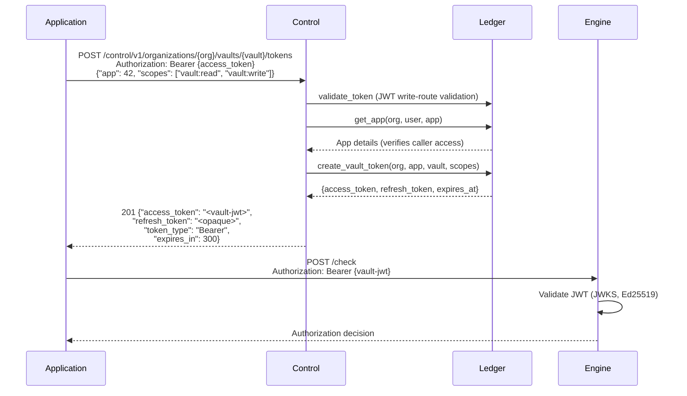

## Client assertion (machine-to-machine)

Backend services authenticate via OAuth 2.0 JWT Bearer (RFC 7523). The client signs a JWT with its Ed25519 private key.

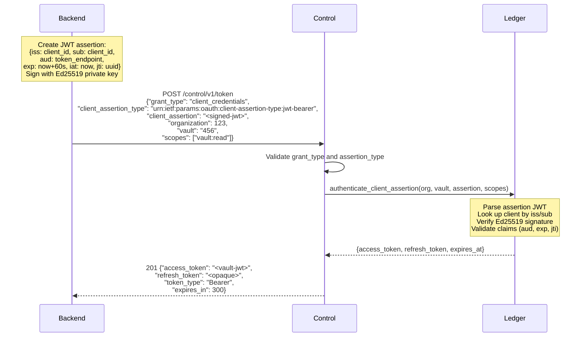

## Session refresh

### User session refresh

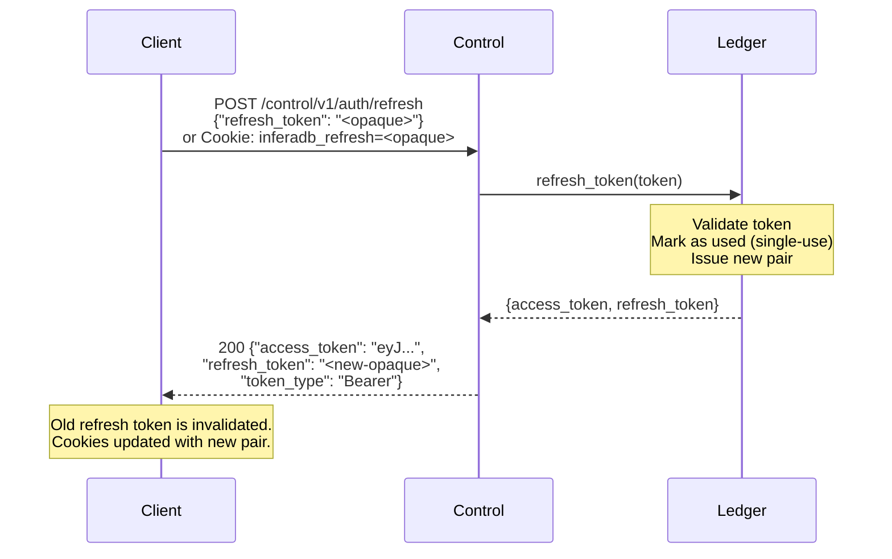

### Vault token refresh

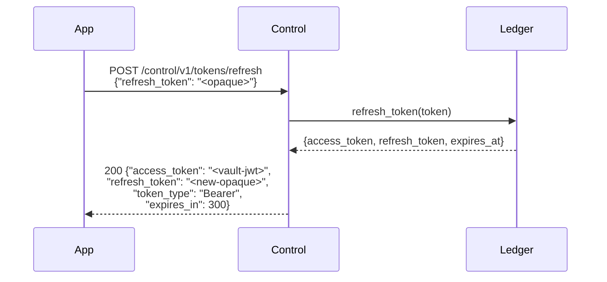

## Logout and revocation

### Logout (current session)

```mermaid
sequenceDiagram
    participant Client
    participant Control
    participant Ledger

    Client->>Control: POST /control/v1/auth/logout<br/>Cookie: inferadb_refresh=<opaque>
    Control->>Ledger: revoke_token(refresh_token)
    Note over Ledger: Best-effort revocation
    Control-->>Client: 200 {"message": "logged out"}<br/>Set-Cookie: inferadb_access=; Max-Age=0<br/>Set-Cookie: inferadb_refresh=; Max-Age=0
```

### Revoke all sessions

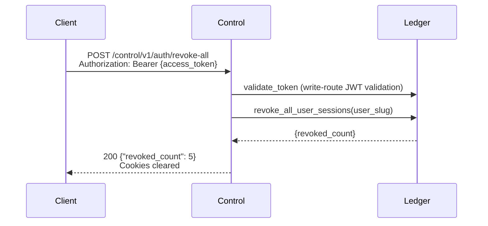

### Revoke vault tokens

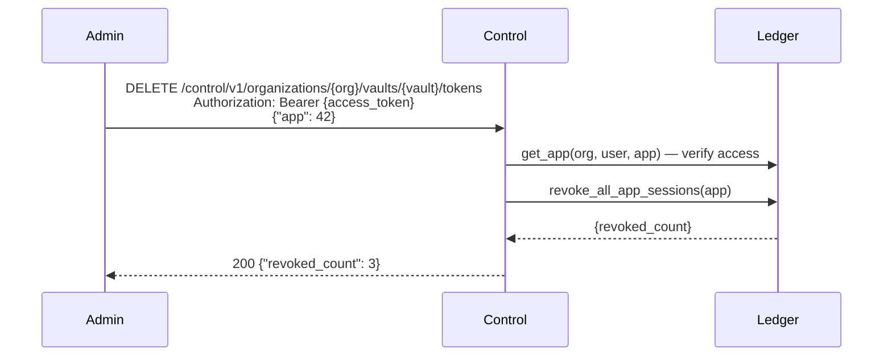

## Email verification

Verify an additional email address added to a user account.

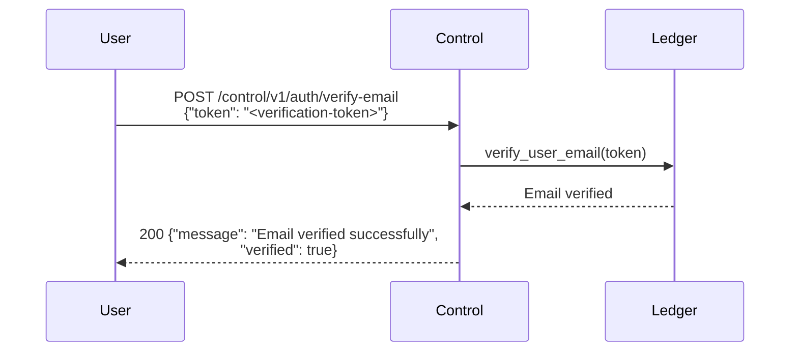

## Rate limiting

All login-related endpoints share a rate limit bucket. Registration has a stricter limit.

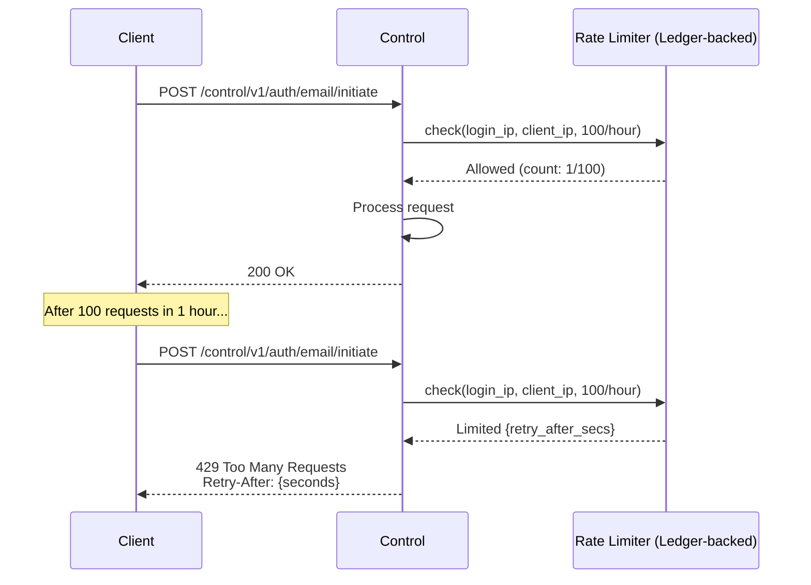

**Rate limit buckets:**

| Bucket            | Endpoints                                                                                                                                                                           | Limit           |
| ----------------- | ----------------------------------------------------------------------------------------------------------------------------------------------------------------------------------- | --------------- |
| `login_ip`        | `/auth/email/initiate`, `/auth/email/verify`, `/auth/totp/verify`, `/auth/recovery`, `/auth/passkey/begin`, `/auth/passkey/finish`, `/token`, `/auth/refresh`, `/auth/verify-email` | 100/hour per IP |
| `registration_ip` | `/auth/email/complete`                                                                                                                                                              | 5/day per IP    |

## Further reading

- [Authentication](authentication.md): Token types, security properties, and configuration reference
- [Architecture](architecture.md): System architecture and deployment topology
